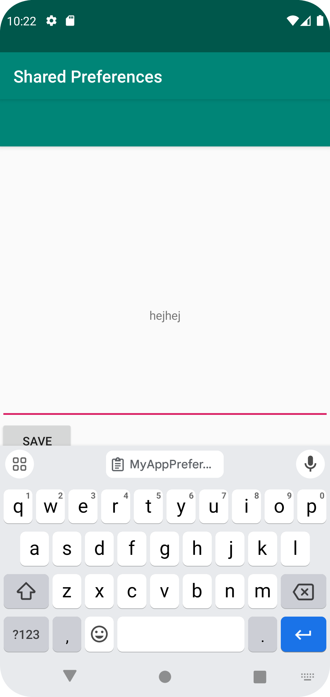
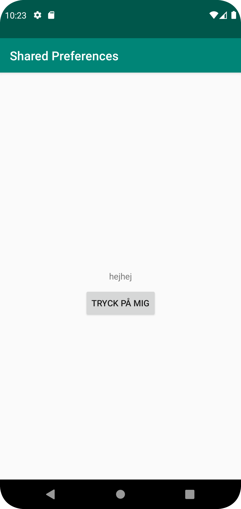

# Rapport

Till början har en ny layout gjorts, med editText, button och textView, och en activity_main2 har skapats.
I editText på den andra sidan, visas det i textView vad som skrivits in efter man tryckt på knappen som skickar texten.
Det som har skrivits in i editText ska även synas på första sidan. 

I första kodsnutten kan vi se att att editText startas igång, och det som skrivs in sparas i myPreferenceEditor. Texten som skrivs in skickas iväg och sparas efter en kanpp har klickats på,
och skickar då iväg texten som skrivits i editText till textviewn i MainActivity2. Detta skickas sedan vidare till en on resume i MainActivity, som tar emot det som skrivits in
och visar det i sin textView.

```
   public void savePref(View v){
        EditText newPrefText=new EditText(this);
        newPrefText=(EditText)findViewById(R.id.settingseditview);

        myPreferenceEditor.putString("MyAppPreferenceString", newPrefText.getText().toString());
        myPreferenceEditor.apply();

        TextView prefTextRef=new TextView(this);
        prefTextRef=(TextView)findViewById(R.id.textView2);
        prefTextRef.setText(myPreferenceRef.getString("MyAppPreferenceString", "No preference found."));

        newPrefText.setText("");
    }
```

Bilder läggs i samma mapp som markdown-filen.




Läs gärna:

- Boulos, M.N.K., Warren, J., Gong, J. & Yue, P. (2010) Web GIS in practice VIII: HTML5 and the canvas element for interactive online mapping. International journal of health geographics 9, 14. Shin, Y. &
- Wunsche, B.C. (2013) A smartphone-based golf simulation exercise game for supporting arthritis patients. 2013 28th International Conference of Image and Vision Computing New Zealand (IVCNZ), IEEE, pp. 459–464.
- Wohlin, C., Runeson, P., Höst, M., Ohlsson, M.C., Regnell, B., Wesslén, A. (2012) Experimentation in Software Engineering, Berlin, Heidelberg: Springer Berlin Heidelberg.
